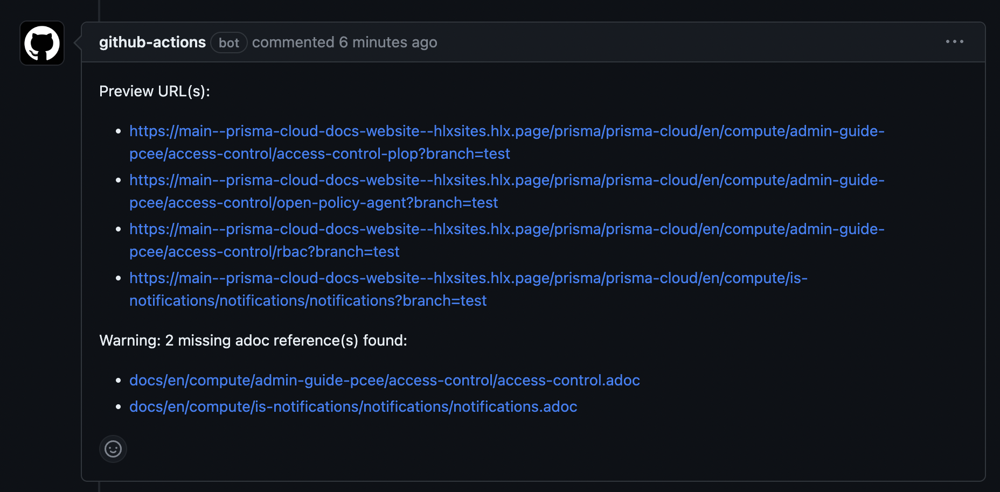
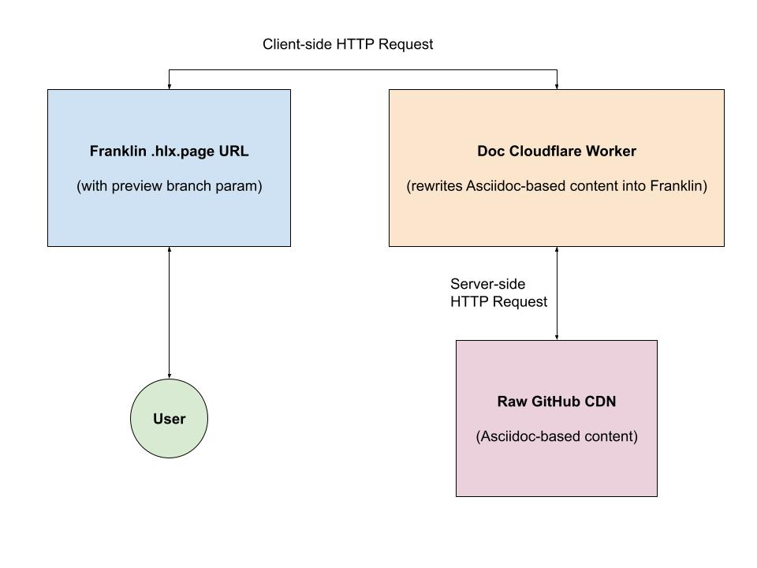
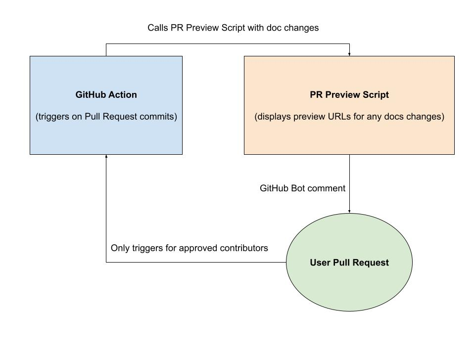
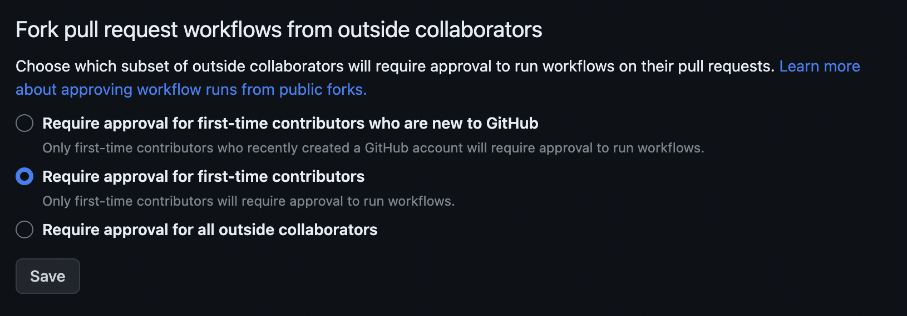

# Preview functionality

Whenever an approved contributor pushes a new branch that changes files in the `docs` folder in the GitHub repository 
and creates a pull request, the preview GitHub action will run and automatically generate preview URLs of the Franklin 
site corresponding to the adoc file changes and verify that adoc files referenced in books are not missing in the 
repository.

The preview functionality is only enabled on `.hlx.page` sites and for local development. It relies on setting the 
search parameter `?branch=` to the Franklin site URL. The branch value should be the name of the pushed branch in the 
repository where the documentation stays.

Example URL with branch param: https://main--prisma-cloud-docs-website--hlxsites.hlx.page/en/compute/ops-guide/getting-started/test-sitemap?branch=ian-test-multi-commit-preview.
The branch `test-multi-commit-preview` maps to the pushed branch `ian-test-multi-commit-preview` https://github.com/hlxsites/prisma-cloud-docs/tree/ian-test-multi-commit-preview.

Once the PR is merged and the branch is deleted, the preview URL will only display the chapter title.

Example message with preview URLs in a PR:



## Preview architecture

### Overview 

**Technical Diagram: Overview**



The `branch` param is passed over to the CF worker which fetches the content from GitHub's CDN 
`raw.githubusercontent.com` for the corresponding branch whether it is adoc, book or images, and finally 
returns Franklin compatible content.

To bypass GitHub's 5min TTL cache, GitHub's API is called to retrieve the branch SHA for the latest commit for a given
branch so that the fetched content from GitHub is always up-to-date for previews.

For details, the code handling the branch resolution can be found [here](https://github.com/hlxsites/prisma-cloud-docs/blob/main/worker/src/routes/docs.ts#L60-L80).

### GitHub Action

**Technical Diagram: GitHub Action**



GitHub actions are stored in the [workflows](../.github/workflows) folder. The GitHub action responsible for displaying
preview URLs can be found [here](../.github/workflows/preview.yaml). The action is importing an ES module that 
handles the logic to check for adoc changes and missing adoc references in books before writing a 
[comment](../bin/preview-changes.js) in the PR.

By default, GitHub will require approval to run the preview workflow for first-time contributors to limit any 
abuse. This option can be found in the repository Actions settings. Learn more about approving 
workflow runs [here](https://docs.github.com/en/actions/managing-workflow-runs/approving-workflow-runs-from-public-forks).



The workflow will also require write permissions. To enable it, go to https://github.com/OWNER/REPO/settings/actions and under the "Workflow Permissions" section, check the option "Read and Write permissions" then hit "Save".

## Env variables and secrets

The env variables are defined in the [wrangler.toml](../wrangler.toml) file. For the preview feature, the following vars
are required to be set: 

```
PREVIEW_UPSTREAM='https://raw.githubusercontent.com'
PREVIEW_REPO_OWNER='hlxsites'
PREVIEW_REPO_NAME='prisma-cloud-docs'
```

[GitHub's rate limit](https://docs.github.com/en/rest/overview/resources-in-the-rest-api?apiVersion=2022-11-28#rate-limiting) 
for unauthenticated requests is 60 requests per hour. To increase the limit, a Personal Access Token is passed when
calling GitHub's API. The PAT is stored as a [Cloudflare Worker secret environment variable](https://developers.cloudflare.com/workers/platform/environment-variables/#add-secrets-to-your-project) 
and only requires repository read access.


